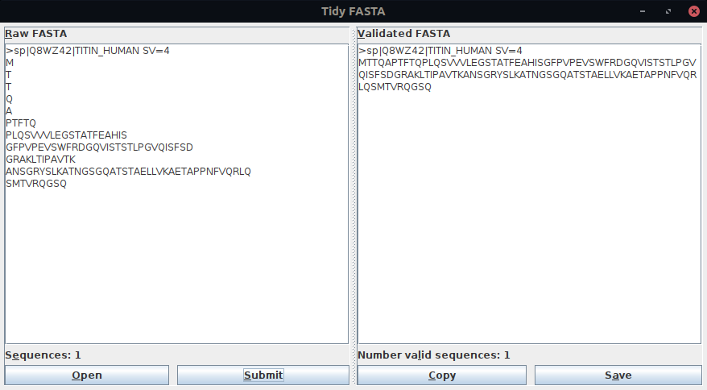

# Tidy FASTA

An open source and cross platform application to fix, and find problems in protein FASTA sequence files.

### Features
tidyFASTA is a cross platform application (Window, Mac OS X, Linux) and is available free of charge and without registration.

### Installation
1. Install java (if required)
    + If Java is not already installed on your computer (version 11 or greater), it is available [here](https://www.oracle.com/java/technologies/javase-jdk14-downloads.html) for all major operating systems.
2. Download the jar file is from the [release tab](https://github.com/maxhebditch/tidyfasta-gui/releases).
3. Run the tidyFASTA-gui file by opening the file, or from the command line.

### Security
tidyFASTA is open source and all processing is run entirely on your local machine.

### Alternatives
tidyFASTA is also available as a python [package](https://github.com/maxhebditch/tidyfasta) package.
